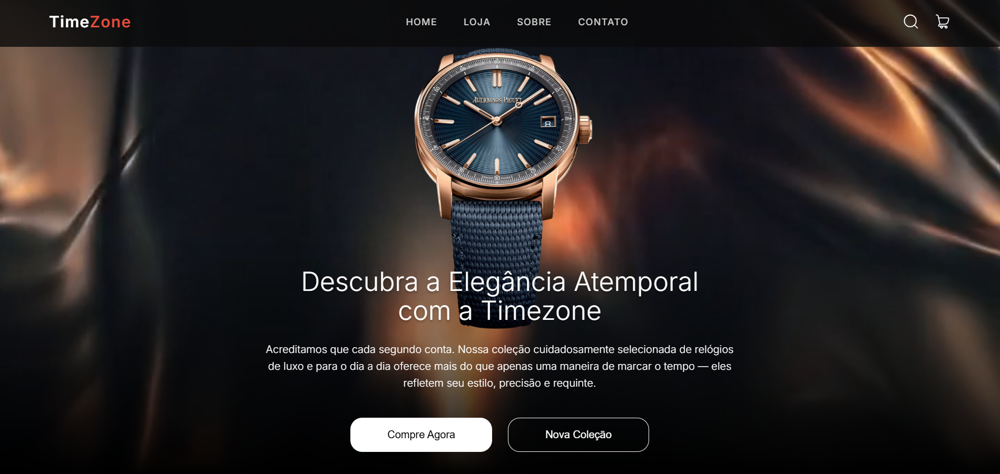
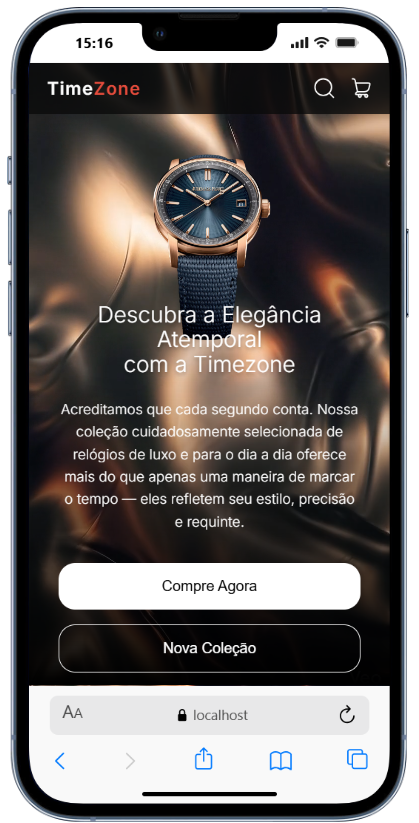

# 🕒 TimeZone - Alta Relojoaria


> Uma Landing Page de luxo desenvolvida com foco implacável em performance, responsividade avançada (Mobile-First) e coleta inteligente de métricas.

## 📑 Índice

- [O Projeto e Motivação](#-o-projeto-e-motivação)
- [Visualização](#-visualização)
- [Funcionalidades e Desafios Superados](#-funcionalidades-e-desafios-superados)
- [Tecnologias](#-tecnologias)
- [Como Rodar Localmente](#-como-rodar-localmente)

---

## 🎯 O Projeto e Motivação

O **TimeZone** foi criado para explorar arquiteturas de UI/UX de alta complexidade sem o uso de bibliotecas de componentes prontas. O objetivo principal foi resolver desafios reais de interface em dispositivos móveis modernos (telas 20:9) e implementar um rastreamento de dados (Analytics) totalmente desacoplado da lógica visual.

---

## 📱 Visualização

### Desktop



### Mobile



---

## ⚙️ Funcionalidades e Desafios Superados

- **Arquitetura de Analytics Escalonável (GA4):** Implementação do padrão de _Delegação de Eventos_ global. Um único espião no `App.jsx` monitora toda a aplicação via atributos `data-ga-action`, mantendo os componentes React totalmente limpos.
- **Fim do "Layout Shift" no Mobile:** Dispositivos recentes sofrem com pulos de tela no scroll. A substituição do `100vh` por `100svh` ancorou a interface perfeitamente no mobile.
- **Carrossel Híbrido (React + CSS):** Ao invés de importar libs pesadas, a movimentação do catálogo de relógios foi feita combinando `flex: 0 0 100%` no CSS e injeção dinâmica de `transform: translateX` no estado do React para deslize nativo a 60fps.
- **Efeito Spotlight 3D:** Uso do `requestAnimationFrame` para calcular e renderizar o eixo X/Y do mouse, criando profundidade interativa nos cards de desktop.

---

## 🛠️ Tecnologias

Projeto focado puramente no domínio sólido do ecossistema de desenvolvimento e interfaces web:

- **Core:** React 18 / JavaScript (ES6+)
- **Build Tool:** Vite
- **Estilização:** CSS3 Modules (Escopo isolado para evitar vazamento de estilos)
- **Ferramentas:** React-GA4 (Métricas)

---

## 🚀 Como Rodar Localmente

## **Pré-requisitos:** Node.js (v18+) e NPM instalados.

## 📂 Estrutura de Pastas

```text
src/
├── components/
│   ├── BrandFilter.jsx      # Filtro de marcas em grid 3x3 (Mobile)
│   ├── Collection.jsx       # Seção principal do catálogo
│   ├── Collection.module.css
│   ├── Hero.jsx             # 1ª dobra com background em vídeo
│   ├── Hero.module.css
│   ├── LimitedEditions.jsx  # Banner final com overlay
│   ├── LimitedEditions.module.css
│   ├── Navbar.jsx           # Header com efeito blur
│   ├── Navbar.module.css
│   ├── TopLogos.jsx         # Logos em grid 3x2 (Mobile)
│   ├── WatchCard.jsx        # Card isolado com efeito 3D
│   └── WatchCarousel.jsx    # Lógica de movimentação lateral
├── data/
│   └── collectionsData.js   # Mock de dados dos relógios
├── hooks/
│   └── useFadeIn.js         # Hook customizado de animação on-scroll
├── App.css
├── App.jsx                  # Cérebro e Hub de Rastreamento (GA4)
├── index.css
└── main.jsx
```

## 👨‍💻 Autor

Desenvolvido por **José William R. Figueira**.
Frontend Developer com forte background em arquitetura estrutural, apaixonado por traduzir regras de negócio complexas em interfaces de alta performance, clean code e UX/UI impecável.

[](https://www.linkedin.com/in/josewilliam-dev/)

---

## 📄 Licença

Este projeto está sob a licença [MIT](https://choosealicense.com/licenses/mit/). Sinta-se livre para clonar e utilizar como base para seus próprios estudos e evoluções no ecossistema React.

```

```
